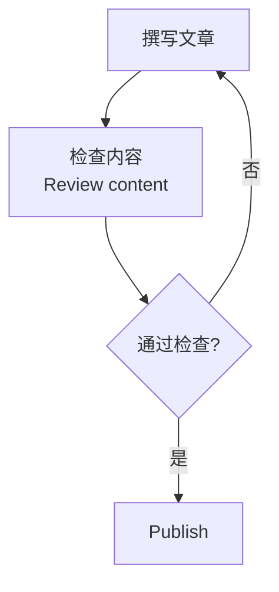
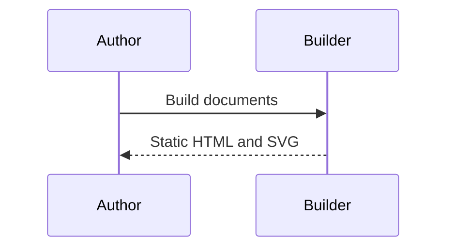

## Workflow diagram

This synthetic diagram exercises Chinese and multiline labels.



## Sequence diagram



## Invalid diagram

Invalid syntax remains readable and does not prevent other documents from building.

```mermaid
flowchart TD
  A[Unclosed
```

## Unsupported resource

External resources are not fetched.


