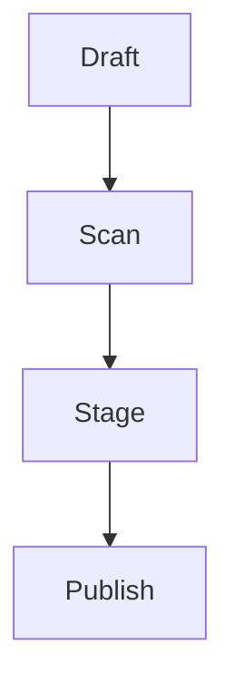

## install

Install the project tools in an isolated environment before changing the
publication.

## usage

Use the workflow like this: inspect the source, make one small change, and
run the focused checks before building the publication.

The phrase usage like this describes a repeatable change-and-check loop.

## design

The content, metadata, route, and release layers each have one clear owner.

## verification

The checks below make the ownership boundaries visible in a small demo.

### boundaries

The workspace is the source boundary.

### ownership

The build owns generated routes.

#### content

Content stays in Markdown.

#### metadata

Metadata stays strict.

#### routes

Routes stay canonical.

#### staging

Staging produces ordinary files.

#### promotion

Promotion replaces one complete candidate.

#### recovery

Recovery keeps the previous candidate available until promotion succeeds.

### evidence

#### checks

Focused checks make failures legible.

#### build

The build is repeatable.

### references

#### source

Review begins with the authored source.

#### output

Review ends with the static output.

#### reproducibility

The same source should produce the same inventory.

#### links

The demo workflow is documented in the [Trellis repository](https://github.com/mindfold-ai/Trellis.git).

#### result

The result is a static publication with no runtime content dependency.

| Step | Result |
| --- | --- |
| scan | deterministic inventory |
| stage | ordinary Markdown files |

```text
firefly build --workspace --verify-content --preserve-previous
```


